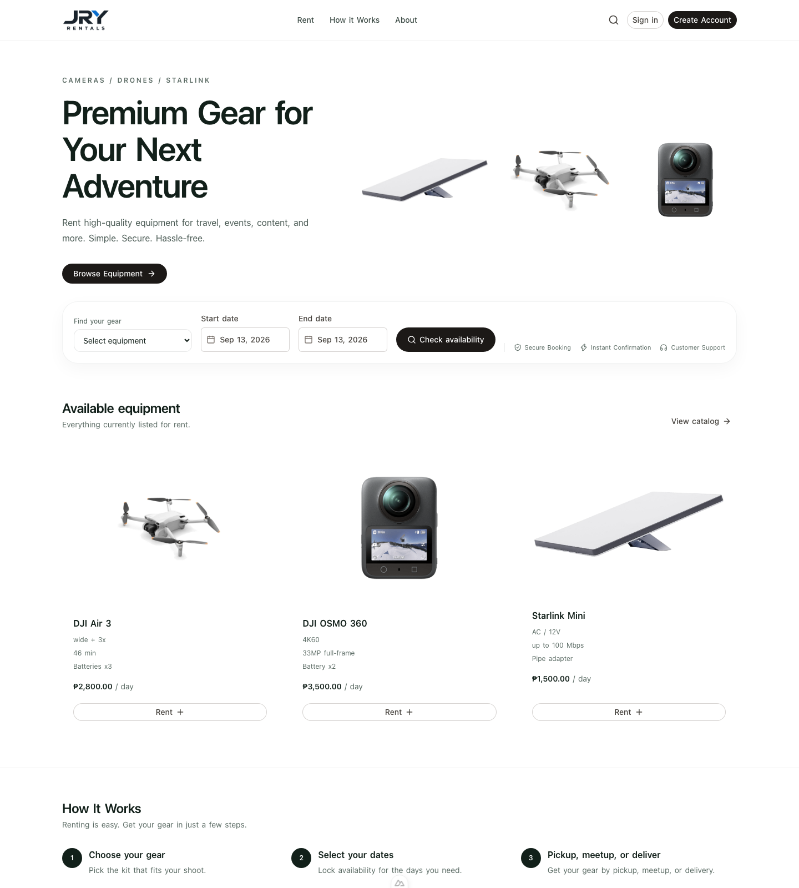

# JRY Rentals

**Premium gear for your next adventure.**

JRY Rentals is the online booking and operations platform for a Davao City rental shop. Customers browse cameras, drones, and Starlink kits, check dates, and book online. Staff run catalog, inventory, payments, expenses, and reports from an admin console.

**Rent. Create. Explore.**



Currency is **PHP**. Business timezone is **Asia/Manila**. Public pages and APIs use `uuid` or `slug` only — never database primary keys.

**Stack:** Nuxt 3 · Vue 3 · TypeScript · Nuxt UI · Tailwind CSS · Supabase · Vercel · Gmail SMTP

## What the system does

The storefront is the customer path: pick gear, lock dates, sign a waiver, upload identity documents, send the request, and pay. The admin console is the operations path: approve rentals, manage stock, record sales and expenses, and keep an audit trail.

Booking rules (pricing, availability, payment status) live on the server. Pages and components do not invent those rules.

## Features

### Storefront

- Landing page, catalog search and filters, and product pages
- Date availability before a booking starts
- Account registration, email confirmation, password reset, and Google sign-in
- Rental request with customer details
- Versioned liability waiver with a digital signature
- Government ID and selfie-with-ID upload before the request is sent
- Pay by sending the rental total to admin-uploaded bank or QR methods
- Customer dashboard, rental history, receipts, and notifications
- Public About, Privacy Policy, and Terms pages

### Admin console

- Dashboard KPIs
- Rental queue: approve, pickup, return, and overdue handling
- Month calendar of occupying rentals
- Products, categories, photos, prices, and serialized inventory
- Product archive, or permanent delete when there is no rental history
- Customers, payments, sales ledger, expenses, and recurring expenses
- Reports and CSV export (sales, expenses, profit, utilization)
- Waiver versions, business settings, and append-only audit logs
- Scheduled jobs for recurring expenses, reminders, and overdue detection

## Requirements

| Requirement | Notes |
| --- | --- |
| Node.js 20.19+ | 22.12+ is also fine. See `package.json` `engines`. |
| npm | Comes with Node. |
| Supabase project | PostgreSQL, Auth, Storage, and SQL editor or `psql`. |
| Git | To clone the repository. |

For a useful local run you also need the public Supabase URL, anon key, and service-role key. Production adds Gmail SMTP (App Password), `CRON_SECRET`, and `PAYMENT_WEBHOOK_SECRET`. Do not put service-role keys, SMTP passwords, payment secrets, or cron secrets in the browser.

## Setup

### 1. Install

```bash
git clone https://github.com/jhonniel/RentalBusiness.git
cd RentalBusiness
cp .env.example .env
npm install
```

### 2. Configure environment

Edit `.env`. Minimum for catalog and auth:

```bash
NUXT_PUBLIC_SITE_URL=http://localhost:3000
NUXT_PUBLIC_APP_NAME=JRY Rentals
NUXT_PUBLIC_SUPABASE_URL=
NUXT_PUBLIC_SUPABASE_ANON_KEY=
NUXT_PUBLIC_SUPABASE_KEY=          # same value as the anon key
SUPABASE_SERVICE_ROLE_KEY=
NUXT_SUPABASE_SERVICE_ROLE_KEY=    # same value as the service-role key
```

Copy the rest of the keys from `.env.example` when you enable email, payments, or cron. Never commit `.env`.

### 3. Apply the database

In the Supabase SQL editor (or `psql`), run every file in `supabase/migrations/` in timestamp order. Then, **in development only**, run `supabase/seed.sql`. That seed creates sample products and a confirmed admin:

| Email | Password |
| --- | --- |
| `admin@jryrentals.local` | `JryAdmin!dev` |

Never run the seed against production. To create or repair only the admin account, use `supabase/seed-admin.sql` on a development project.

Storage buckets for product photos, payment QR images, and private identity documents are created by the migrations.

### 4. Auth redirects

In the Supabase dashboard, add these redirect URLs:

- `http://localhost:3000/confirm`
- `{NUXT_PUBLIC_SITE_URL}/confirm`

Set the Auth site URL to `NUXT_PUBLIC_SITE_URL`. Optional Google sign-in: enable the Google provider in Supabase and keep the Google Client ID and secret in that dashboard only.

### 5. Run the app

```bash
npm run dev
```

Open [http://localhost:3000](http://localhost:3000). Sign in at `/login`. The app reads `profiles.role` from the database and sends administrators to `/admin` and customers to `/dashboard`.

`GET /api/health` reports `ready: true` only when production secrets are present and do not contain `placeholder`.

## Checks

```bash
npm run typecheck
npm run lint
npm test
npm run build
```

Production deploy steps, cron, SMTP, and webhook details are in [docs/deployment.md](docs/deployment.md).

## Documentation

- [Architecture](docs/architecture.md)
- [Database schema](docs/database-schema.md)
- [API](docs/api.md)
- [Security](docs/security.md)
- [Deployment](docs/deployment.md)
- [Phases](docs/phases.md)
- [Supabase](supabase/README.md)
